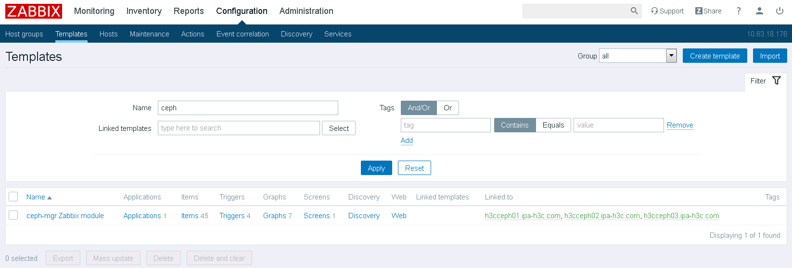
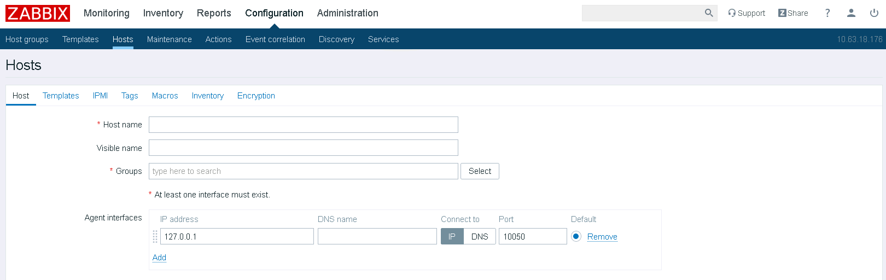
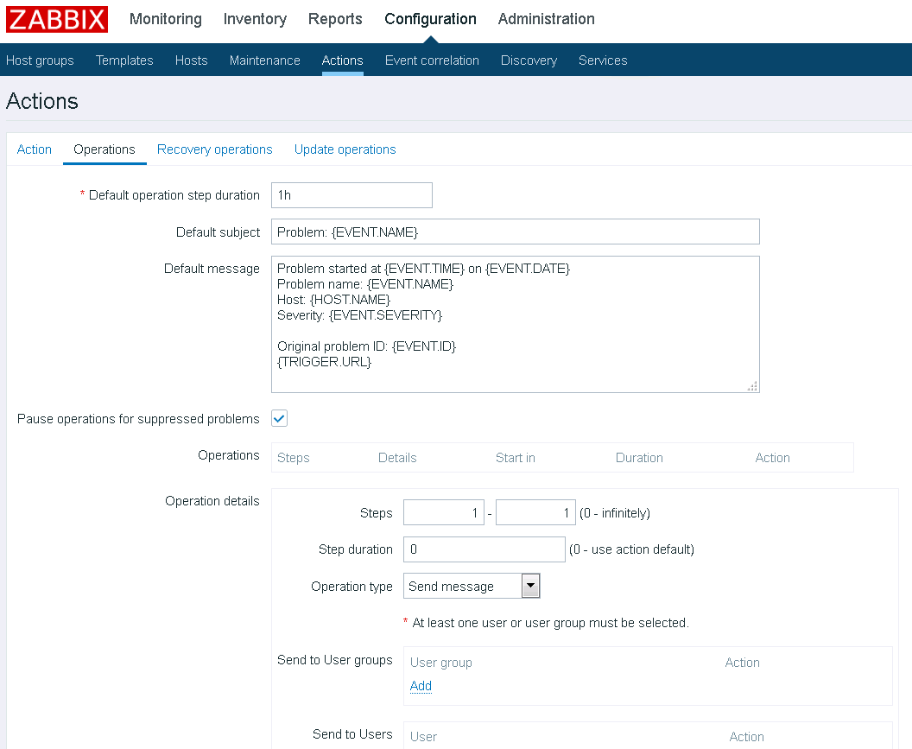

CEPH可以通过mgr节点的zabbix模块实现监控

不同于普通的agent模式，CEPH自带的zabbix模块通过trapper模式工作，mgr节点收集集群信息并向Zabbix Server发送。 
## 1、环境说明：
3节点CEPH集群，每个node都是mgr节点;  
部署Nautilus 14.2.7；  
Zabbix Server版本：4.2.1  
## 2、安装部署：
在所有mgr节点上安装zabbix-sender  
**配置yum：**
```
# rpm -Uvh https://repo.zabbix.com/zabbix/4.4/rhel/7/x86_64/zabbix-release-4.4-1.el7.noarch.rpm
```
**安装sender：**
```
# yum install zabbix-sender -y
```
## 3、配置zabbix模块：
在任意一个mgr节点上执行如下配置：  
启用zabbix module：
```
# ceph mgr module enable zabbix
```
指定zabbix server，如果有多个可以用","隔开，并且可以添加":"来指定服务器端口，此处只有最简单的配置：  
```
# ceph zabbix config-set zabbix_host zabbix.test.com
```
指定zabbix_sender的位置：  
```
# which zabbix_sender 
/usr/bin/zabbix_sender


# ceph zabbix config-set zabbix_sender /usr/bin/zabbix_sender
Configuration option zabbix_sender updated
```
指定identifier，这里很奇怪，只能是某个mgr节点的主机名，其他的可以设置成功但是发送失败，不知道我哪里配的有问题：  
```
# ceph zabbix config-set identifier "ceph01.test.com"
```
后面如果有需要可以定义server的端口等，命令跟前面的相仿，这里就不配了。  
查看一下当前的配置：  
```
# ceph zabbix config-show
```
查看一下自带的监控模板，后面会用到：  
```
# find / -iname zabbix_template.xml
/usr/share/ceph/mgr/zabbix/zabbix_template.xml
```
## 4、配置zabbix server：
登录Zabbix Web UI导入前面找到的监控模板，模板也可以在[github](http://www.voidcn.com/link?url=https://github.com/ceph/ceph/tree/master/src/pybind/mgr/zabbix)中找，默认选项导入即可：  




创建主机组：  


添加主机并关联主机组和模板，如果有需要主机可以关联多个模板，比如系统的监控：  





配置用户告警：
  


至此配置完成。

## 5、测试配置
任意一台mgr节点测试：  
```
# ceph zabbix send 
Sending data to Zabbix
```
如果发送不成功会导致ceph健康状态告警，检查端口通信情况及zabbix server的trapper模式是否被禁用，以及上面的步骤是不是哪里配置错了。  


> [https://docs.ceph.com/docs/master/mgr/zabbix/](https://docs.ceph.com/docs/master/mgr/zabbix)  
> [https://www.cnblogs.com/lbjstill/p/12169820.html](https://www.cnblogs.com/lbjstill/p/12169820.html)