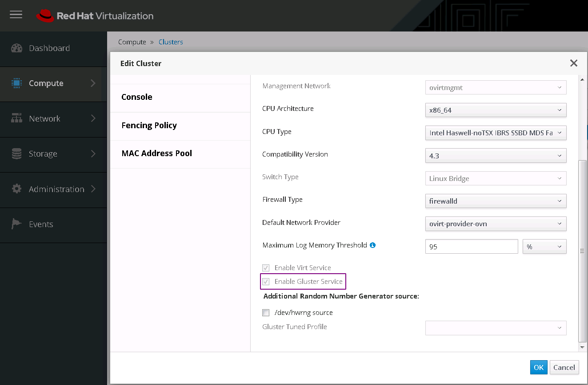

一直不知道为啥红帽会把RHHI放进存储产品线，明明就是个虚拟化环境的超融合环境，甚至安装介质跟rhv都是一样的，两者只有部署方式上的差异。  
从最开始的RHV一直用到现在的RHHI，红帽的产品没有VMWare那么丰富的接口，却也别有特色，用习惯了感觉也不错。~~才不是用多了国产的烂玩意才有的这种感觉。~~  

这两天环境被弄乱了，就图省事不修了，重新部署了一套了事，记录一点过程：

首先，要有RHVH的订阅，没有就去下ovirt，rhv对应的开源版本就是它；  
其次，红帽对此的文档已经很详细了，也不需要帐号就可以阅读，相关的两篇文档如下：  
https://access.redhat.com/documentation/en-us/red_hat_hyperconverged_infrastructure_for_virtualization/1.7/html/deploying_red_hat_hyperconverged_infrastructure_for_virtualization/deployment_workflow#enabling-software-repositories

https://access.redhat.com/documentation/en-us/red_hat_virtualization/4.4-beta/html/administration_guide/sect-preparing_and_adding_nfs_storage

注意，第一篇部署文档里没提到的是宿主机的主机名需要被DNS解析，否则部署host-engin的时候会过不去地址检测。  
第二篇文档要注意的是nfs的权限设置，不是随便哪个nfs都能在rhv环境中挂起来的。  
然后，按照文档部署完成之后要在compute->cluster里把enable gluster service的勾勾上，不然在storage->volumes里管理不到先前创建的gluster卷。

最后，就可以慢慢用了，从rhv2到3再到如今的4.3，改变还是蛮大的，也明显越来越好用了。虽然不是主流产品，但是如果有超融合需求，不妨尝试一下，毕竟有免费的开源版本ovirt。  
但是4.3的RHV有个最坑的地方，由于宿主机是基于RHEL7的系统，因此无法将RHEL8的系统做成模板，因为rhel8中xfs有新特性，而这点居然写在了RHV4.4的文档里，而不是4.3的……