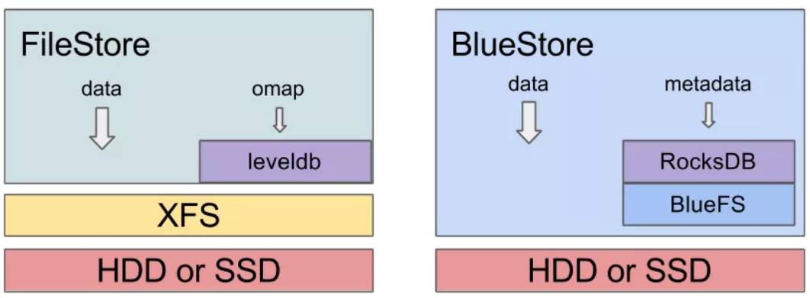

## 背景
终于准备用Nautilus做生产环境了！  
目前，Ceph 主要有三种企业级应用场景：  
- IOPS 密集型：这种类型的场景通常是支撑在虚拟化/私有云上运行数据库。如在 OpenStack 上运行 Mysql、MariaDB 或 PostgreSQL 等。IOPS 密集型场景对磁盘的性能要求较高，最好使用全闪架构。如果使用混合架构，机械盘转速需要 1.2 万，并使用高速盘存储频繁写操作的日志或元数据。
- 高吞吐量型：这种类型的应用场景主要是大块数据传输，如图像、视频、音频文件等。高吞吐量型磁盘的要求没有 IOPS 密集型高，但需要配置较高的网络。同时也需要配置 SSD 来处理写日志。
- 高容量型：这种场景主要用于存储归档、离线数据。它对磁盘的容量要求高，对性能无过多要求。写日志也可以存储在 HDD 上。  
此次计划部署一套带宽型的用来提供S3服务，所以部署第二种就好。
## 硬件规划：
nautilus采用blustore比filestore的性能大大提升，毕竟传输路径短了很多：  

随之而来的问题是BlueStore 存储引擎的实现，需要存储数据和元数据。目前 Ceph BuleStore 的元数据存储在 RocksDB（K-V 数据库）中。通过为 RocksEnv 提供操作接口，RocksDB 存放在 BlueFS 上。由于 BlueFS 最终通过 RocksDB，承载的是 BlueStore 存储引擎中的元数据，因此它的性能会很大程度上影响整个 Ceph 的性能。所以，要为它提供高速硬盘。  
Redhat建议，在新的bluestore架构下，如果用NVMe做metedata/jouranl，对应HDD的OSD是1：12；如果普通SSD做metedata/jouranl，则与HDD的比例为1：4 [1](https://access.redhat.com/documentation/en-us/red_hat_ceph_storage/4/html/hardware_guide/server-and-rack-solutions_hw)
在此基础上，其他按照官方建议配置。  
| Device  | Size            | Count | Use       |
|:------- | :--------------- | :----- | :--------- |
| CPU     | Inter Xeon 6252 | 2     |           |
| Memor   | 32GB            |       |           |
| DISK    | 4TB             | 12    | OSD       |
| SSD     | 480GB           | 2     | Operation |
| NVMe    | 4TB             | 2     | blockk.db |
| Network | 10GB            | 2     |           |

以上配置保证了：  
1、每HDD的OSD至少对应5GB内存；  
2、每2 GHZ CPU每0.5 Cores每HDD；  
3、前端网络和后端网络的带宽，提供每12OSD有10GB带宽；  
4、SSD组成raid1保证操作系统安全；  
5、NVMe通过PCIE组成raid1，简化db磁盘损坏后的更换（此处不符合官方最佳实践）  

共6台这样硬件配置的服务器，每台的作用如下：  
| hostname | IP addr | Roles |
| -------- | -------- | -------- |
| rhcs01-st   | 10.64.0.80  10.64.4.80| OSD  MON MGR |
| rhcs02-st   | 10.64.0.81  10.64.4.81| OSD  RGW MDS |
| rhcs03-st   | 10.64.0.82  10.64.4.82| OSD  MON MGR |
| rhcs04-st   | 10.64.0.83  10.64.4.83| OSD  RGW MDS |
| rhcs05-st   | 10.64.0.84  10.64.4.84| OSD  MON MGR |
| rhcs06-st   | 10.64.0.85  10.64.4.86| OSD  RGW MDS |
## 软件计划：
确定使用RHCS4.1来部署，其与开源版本对应关系如下：  
|Upstream Code Name |	Downstream Release Name |	Red Hat Ceph Storage Package Version (RHEL 8.x) 	|Red Hat Ceph Storage Package Version (RHEL 7.x) 	|Red Hat Ceph Ansible Package Version 	Release Month|
| -------- | -------- | -------- | -------- | -------- | -------- | 
| Nautilus 	Red Hat Ceph Storage 4.1 | 	14.2.8-59.el8cp | 	14.2.8-50.el7cp | 	ceph-ansible-4.0.23-1 | 	June, 2020| 
Nautilus | 	Red Hat Ceph Storage 4.0 | 	14.2.4-125.el8cp | 	14.2.4-51.el7cp | 	ceph-ansible-4.0.14-1 | 	January, 2020| 

而RHCS4支持的操作系统如下：  
| Vendor | Version | 
| -------- | -------- | 
| Redhat Enterprise Linux   | 8.2 8.1  |
| Redhat Enterprise Linux   | 7.8 7.7  |

因此，系统选用RHEL8.2

## 小结
选定了软件版本后，按标准来配置即可。由于是分布式存储，主要还是考虑硬盘和网络，而硬盘的配置跟存储整个架构有很大关系。

## 参考文档：
https://access.redhat.com/documentation/en-us/red_hat_ceph_storage/4/html/hardware_guide/index